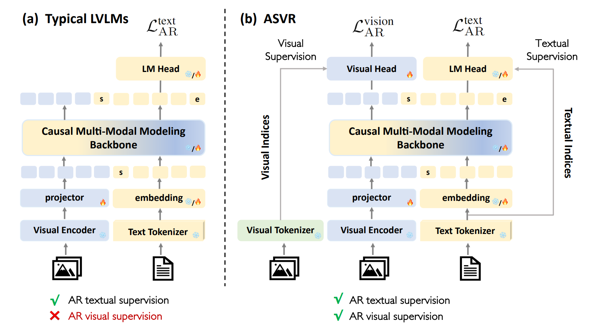
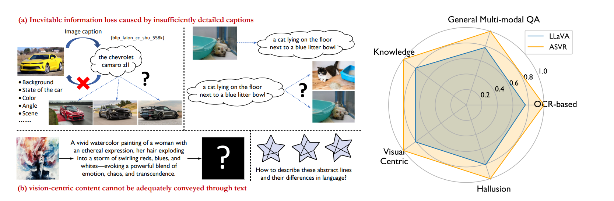

# ASVR: Autoregressive Semantic Visual Reconstruction Helps VLMs Understand Better

<h4 align="left">

[Dianyi Wang**](https://scholar.google.com/citations?hl=zh-CN&user=iP2HPFEAAAAJ), 
[Wei Song**](https://scholar.google.com/citations?hl=zh-CN&user=k0blIUIAAAAJ), 
[Yikun Wang](https://scholar.google.com/citations?hl=zh-CN&user=4E7YCn4AAAAJ),
[Siyuan Wang](https://siyuanwangw.github.io/),
[Kaicheng Yu](https://www.yukaicheng.cn/),
[Zhongyu Wei](http://www.fudan-disc.com/people/zywei), and
[Jiaqi Wang](https://myownskyw7.github.io/).

<h5 align="left">

🤔 Can autoregressive visual generation supervision improve VLMs' understanding capability? 

🚀 Reconstructing the visual semantics of images leads to better visual comprehension.

> **Abstract.** Typical large vision-language models (LVLMs) apply autoregressive supervision solely to textual sequences, without fully incorporating the visual modality into the learning process. This results in three key limitations: (1) an inability to utilize images without accompanying captions, (2) the risk that captions omit critical visual details, and (3) the challenge that certain vision-centric content cannot be adequately conveyed through text. As a result, current LVLMs often prioritize vision-to-language alignment while potentially overlooking fine-grained visual information. While some prior works have explored autoregressive image generation, effectively leveraging autoregressive visual supervision to enhance image understanding remains an open challenge. In this paper, we introduce Autoregressive Semantic Visual Reconstruction , which enables joint learning of visual and textual modalities within a unified autoregressive framework. We show that autoregressively reconstructing the raw visual appearance of images does not enhance and may even impair multimodal understanding. In contrast, autoregressively reconstructing the semantic representation of images consistently improves comprehension. Notably, we find that even when models are given continuous image features as input, they can effectively reconstruct discrete semantic tokens, resulting in stable and consistent improvements across a wide range of multimodal understanding benchmarks. Our approach delivers significant performance gains across varying data scales (556k-2M) and types of LLM bacbones. Specifically, ASVR improves LLaVA-1.5 by 5% in average scores across 14 multimodal benchmarks.





## Release
- [2025/06/09] 🔥 We have released **ASVR**. Checkout the [paper](https://arxiv.org/abs/2506.09040) for details.


## Contents
- [Install](#install)
- [Train](#train)
- [Evaluation](#evaluation)

## Install

If you are not using Linux, do *NOT* proceed.

1. Clone this repository and navigate into the codebase
```bash
git clone https://github.com/AlenjandroWang/ASVR.git
cd asvr
```

2. Install Package
```Shell
conda create -n asvr python=3.10 -y
conda activate asvr
pip install --upgrade pip  # enable PEP 660 support
pip install -e .
```

3. Install additional packages for training cases
```
pip install -e ".[train]"
pip install flash-attn --no-build-isolation
```
## Train
ASVR training consists of two stages: 
(1) Pretrain: Focus solely on optimizing the projector and the visual head to connect frozen pretrained vision encoders to a frozen LLM;
(2) Instruction Tuning: Train projector, visual head and LLM to make model follow multimodal instructions.

For GPU training on fewer GPUs, reduce the per_device_train_batch_size and increase the gradient_accumulation_steps accordingly, ensuring the global batch size remains the same: per_device_train_batch_size x gradient_accumulation_steps x num_gpus.

### Download visual tokenizer config and checkpoints

ASVR takes the visual tokenizer from [Dualtoken](https://huggingface.co/Songweii/DualToken) to construct visual supervision targets.
Downloading the config from [this URL](https://drive.google.com/file/d/16iZh-M1TRVM7_7AwcMwYKMhL2JBAg6l4/view?usp=sharing) and checkpoints from [this URL](https://drive.google.com/file/d/11jyGk2AssI5Irb71BExfssXEWFLsKfoY/view?usp=sharing) and put them into ```./model_zoo```.

### Pretrain


Pretrain Data ASVR used in the paper are include [LLaVA-1.5-pretrain-558k](https://huggingface.co/datasets/liuhaotian/LLaVA-Pretrain) and [bunny-pretrain-laion-2m](https://huggingface.co/datasets/BoyaWu10/Bunny-v1_1-data) 


Training script with DeepSpeed ZeRO-2 can be found in ```scripts/pretrain.sh```. Global Batch Size is 256

- `--vision_tokenizer`: the visual tokenizer config.
- `--vision_tokenizer_weight`: the visual tokenizer checkpoints.

### Instruction Tuning

Instruction Tuning Data ASVR used in the paper are include [LLaVA-1.5-665K](https://huggingface.co/datasets/liuhaotian/LLaVA-Instruct-150K/blob/main/llava_v1_5_mix665k.json) , [LLaVA-Next-779K](https://huggingface.co/datasets/lmms-lab/LLaVA-NeXT-Data)and [Bunny-v1_1-data-2M](https://huggingface.co/datasets/BoyaWu10/Bunny-v1_1-data) 

Training script with DeepSpeed ZeRO-2 can be found in ```scripts/finetune.sh```. Global Batch Size is 128

## Evaluation

In ASVR, we evaluate models on a diverse set of benchmarks implemented based on [Cambrian-1](https://github.com/cambrian-mllm/cambrian/tree/main/eval)


## Citation

If you find ASVR useful for your research and applications, please cite using this BibTeX:
```bibtex
@misc{wang2025autoregressivesemanticvisualreconstruction,
      title={Autoregressive Semantic Visual Reconstruction Helps VLMs Understand Better}, 
      author={Dianyi Wang and Wei Song and Yikun Wang and Siyuan Wang and Kaicheng Yu and Zhongyu Wei and Jiaqi Wang},
      year={2025},
      eprint={2506.09040},
      archivePrefix={arXiv},
      primaryClass={cs.CV},
      url={https://arxiv.org/abs/2506.09040}, 
}
```

## Acknowledgement
- [LLaVA](https://github.com/haotian-liu/LLaVA): the codebase we built upon and the dataset we utilized.
- [Bunny](https://github.com/BAAI-DCAI/Bunny): the dataset we utilized.
- [LLaVA-Next](https://github.com/LLaVA-VL/LLaVA-NeXT): the dataset we utilized.
- [Cambrian-1](https://github.com/cambrian-mllm/cambrian): the evaluation codebase we utilized.
- [Mistral](https://huggingface.co/mistralai) and [Vicuna](https://github.com/lm-sys/FastChat): We thank Vicuna and Mistral for the open-source LLM checkpoints.
